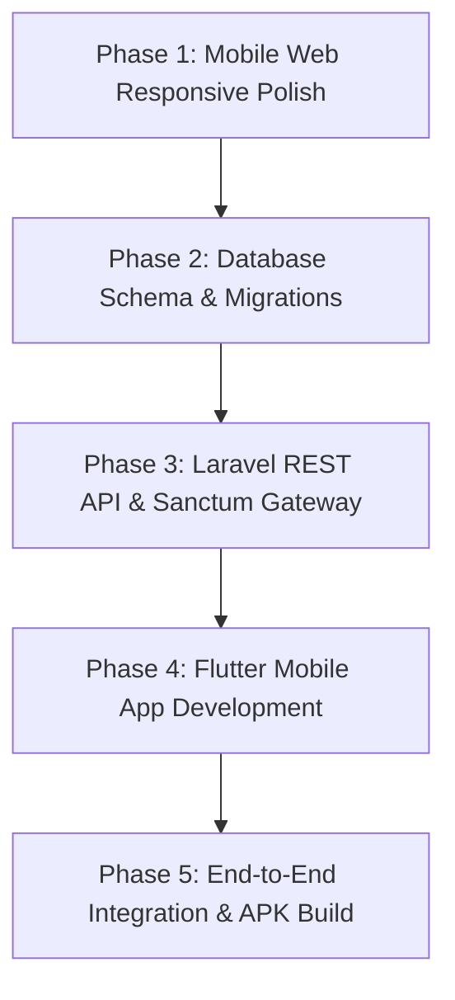

# HITAM Hostel Portal & Mobile Application: Master Execution Plan

**Project:** HITAM Hostel Residential Management System  
**Selected Architecture:** Approach B [Path 1] — Laravel 11 Cloud Backend (Hostinger) + Unified Flutter Mobile Application (Android / iOS)  
**Target Release Platforms:** Mobile Web Responsive Browser, Android (`.apk` / `.aab`), and iOS (`.ipa` / TestFlight / App Store)  
**Status:** Active Roadmap & Phase-by-Phase Proceedings  

---

## 1. Executive Validation & Answers to Your Strategic Questions

### A. Can you delete `Architecture_Evaluation_Report.md` now?
> [!NOTE]  
> **Yes, you can safely delete `Architecture_Evaluation_Report.md` (or archive it).**  
> That document was an exhaustive comparative evaluation to decide between native Kotlin, Flutter, React Native, Node/Next.js, and Capacitor. Since the final decision is locked into **Approach B (Laravel Backend/API + Flutter Cross-Platform App)**, that evaluation has fulfilled its purpose. All actionable architecture decisions and guidelines have been synthesized into this Master Execution Plan.

---

### B. Is your proposed 4-step sequence appropriate, or are we missing anything?
Your high-level intuition is spot-on:
1. *Better the design of mobile browser view of the site.*
2. *Design the database, tables and attributes.*
3. *Make the Flutter application and run with Android Studio.*
4. *Attach all endpoints and put in gateways.*

#### Critical Refinements & What Needs to be Accounted For:

1. **Hostinger Database Connectivity Clarified (Crucial Concept)**:
   * You previously noted: *"apk can't access the hostinger DB I think"*.
   * In professional software engineering, **mobile apps NEVER connect directly to a remote MySQL port 3306**. Doing so exposes database passwords inside the decompiled APK, creates massive security vulnerabilities, and is blocked by Hostinger’s firewall.
   * **The Industry Standard Solution:** Flutter communicates exclusively over **HTTPS REST API** (`https://yourhosteldomain.com/api/v1/...`). The Laravel backend hosted on Hostinger handles the database queries locally over `localhost:3306`. Therefore, **Hostinger MySQL works 100% seamlessly and securely** for both the Web and the Mobile App!

2. **Optimal Sequencing of Database & API Endpoints**:
   * Instead of building the Flutter app first and *then* creating the endpoints at the very end, the cleanest engineering flow is:
     $$\text{Design DB (Tables \& Migrations)} \longrightarrow \text{Expose Laravel API Endpoints} \longrightarrow \text{Build \& Connect Flutter App}$$
   * If endpoints and request/response JSON contracts are defined right after the DB schema, the Flutter app can be wired up to live data immediately in Android Studio without having to build mock systems twice.

3. **Authentication Gateway Strategy**:
   * **Web Portal (Admin / Warden / Web Student):** Session-based cookie authentication with CSRF protection.
   * **Flutter Mobile App (Student):** **Laravel Sanctum** token-based authentication (Bearer Tokens). Upon login, the app securely stores the token in encrypted device storage (`flutter_secure_storage`) and attaches `Authorization: Bearer <token>` to subsequent requests.

---

## 2. Master System Architecture Overview

```text
                               ┌───────────────────────────────────────────────┐
                               │                 END-USER CLIENTS              │
                               │                                               │
                               │  ┌─────────────────────────┐  ┌─────────────┐ │
                               │  │   Flutter Mobile App    │  │  Responsive │ │
                               │  │  (Android APK & iOS)    │  │  Mobile Web │ │
                               │  │    Dart / Material 3    │  │ Blade + CSS │ │
                               │  └───────────┬─────────────┘  └──────┬──────┘ │
                               └──────────────┼───────────────────────┼────────┘
                                              │ HTTPS (JSON)          │ HTTPS
                                              │ Bearer Token          │ Cookie / Session
                                              ▼                       ▼
┌──────────────────────────────────────────────────────────────────────────────┐
│                    HOSTINGER CLOUD / LARAVEL 11 BACKEND                      │
│                                                                              │
│    ┌──────────────────────────────────┐  ┌───────────────────────────────┐   │
│    │    REST API Gateway (Sanctum)    │  │     Web Routing & Views       │   │
│    │     routes/api.php (/api/v1)     │  │        routes/web.php         │   │
│    └─────────────────┬────────────────┘  └───────────────┬───────────────┘   │
│                      │                                   │                   │
│                      ▼                                   ▼                   │
│    ┌─────────────────────────────────────────────────────────────────────┐   │
│    │                     Core Business Service Layer                     │   │
│    │   (Auth, Room Allocation, Outpass / Leave, Complaints, Notices)     │   │
│    └─────────────────────────────────┬───────────────────────────────────┘   │
│                                      ▼                                       │
│    ┌─────────────────────────────────────────────────────────────────────┐   │
│    │                    Database Layer (Hostinger MySQL)                 │   │
│    │         InnoDB Transactions, Foreign Keys, Audit Trails             │   │
│    └─────────────────────────────────────────────────────────────────────┘   │
└──────────────────────────────────────────────────────────────────────────────┘
```

---

## 3. Phase-by-Phase Roadmap



---

### Phase 1: Mobile Web Browser View Refinement (Immediate)
*Goal: Ensure the existing Laravel Blade views render seamlessly on all mobile screens (360px - 430px) without horizontal scrolling or broken tap targets.*

1. **Responsive Viewport & CSS Refinements**:
   - Audit `portal.css`, `app.css`, and navigation bars for mobile breakpoint behavior (`@media (max-width: 768px)`).
   - Implement bottom navigation bar or collapsible hamburger off-canvas drawer for mobile browser view.
   - Adjust font scales, button padding, and card layouts so key actions (Apply for Outpass, Register Complaint, Pay Fees) are touch-friendly (minimum 48px touch target).
2. **Mobile Form Ergonomics**:
   - Ensure input fields trigger proper mobile keyboards (`type="tel"` for phone numbers, `type="email"` for student emails, date pickers for leave dates).
   - Prevent iOS auto-zoom on form inputs by ensuring `font-size: 16px` on form controls.
3. **Portal Layouts**:
   - Polish Student Dashboard cards (Room details, Outpass status badge, recent complaints).
   - Polish Admin/Warden management tables with horizontal card/accordion fallbacks on narrow screens.

---

### Phase 2: Relational Database Design, Tables & Attributes
*Goal: Create a rock-solid, normalized MySQL schema with Laravel migrations and seeders.*

#### Target Database Tables & Core Attributes:

| Table Name | Primary Purpose | Key Fields / Foreign Keys |
|---|---|---|
| **`users`** | Base identity & credentials | `id`, `name`, `email`, `password`, `role` (`student`, `warden`, `admin`), `avatar_url`, `is_active` |
| **`students`** | Specific student profile | `id`, `user_id` (FK), `roll_number`, `department`, `year_of_study`, `phone`, `parent_name`, `parent_phone`, `emergency_contact`, `blood_group`, `gender` |
| **`hostels`** | Hostel buildings | `id`, `name` (Boys Hostel, Girls Hostel), `code`, `gender_type`, `total_capacity`, `warden_in_charge_id` |
| **`blocks`** | Hostel blocks/wings | `id`, `hostel_id` (FK), `block_name` (Block A, Block B, East Wing) |
| **`floors`** | Floor breakdown | `id`, `block_id` (FK), `floor_number` |
| **`rooms`** | Individual rooms | `id`, `floor_id` (FK), `room_number`, `capacity` (2, 3, 4 sharing), `room_type` (`AC`, `Non-AC`), `base_fee` |
| **`beds`** | Specific bed within room | `id`, `room_id` (FK), `bed_identifier` (A, B, C), `status` (`available`, `occupied`, `maintenance`) |
| **`room_allocations`** | Student bed assignments | `id`, `student_id` (FK), `bed_id` (FK), `academic_year`, `allocated_from`, `allocated_to`, `status` (`active`, `vacated`, `cancelled`) |
| **`outpasses` / `leaves`** | Gate passes & leave tracking | `id`, `student_id` (FK), `leave_type` (`day_pass`, `weekend`, `vacation`, `emergency`), `destination`, `reason`, `out_datetime`, `in_datetime`, `parent_consent` (`bool`), `status` (`pending`, `approved`, `rejected`), `approved_by` (FK), `qr_verification_code` |
| **`complaints`** | Maintenance ticketing | `id`, `student_id` (FK), `room_id` (FK), `category` (`electrical`, `plumbing`, `wifi`, `cleaning`, `carpentry`), `title`, `description`, `photo_url`, `priority` (`low`, `medium`, `high`), `status` (`submitted`, `in_progress`, `resolved`), `warden_remarks` |
| **`notices`** | Announcements | `id`, `title`, `content`, `target_audience` (`all`, `boys_hostel`, `girls_hostel`), `published_by` (FK), `attachment_url`, `created_at` |
| **`fee_transactions`** | Hostel fee receipts & status | `id`, `student_id` (FK), `amount`, `payment_type` (`hostel_fee`, `mess_fee`, `amenity_fee`), `transaction_id`, `status` (`paid`, `pending`, `failed`), `receipt_path` |

---

### Phase 3: Laravel REST API & Authentication Gateway
*Goal: Provide clean, fast, and documented JSON endpoints for the Flutter app.*

1. **Install & Configure Laravel Sanctum**:
   ```bash
   composer require laravel/sanctum
   php artisan vendor:publish --provider="Laravel\Sanctum\SanctumServiceProvider"
   ```
2. **CORS & API Route Groups (`routes/api.php`)**:
   - Ensure `config/cors.php` allows mobile requests and headers.
   - Set up API versioning prefix: `/api/v1/`.
3. **Core Endpoints Matrix**:
   - **Auth**: `POST /api/v1/auth/login` (returns Sanctum Bearer Token), `POST /api/v1/auth/logout`, `GET /api/v1/auth/me`.
   - **Student Profile & Room**: `GET /api/v1/student/profile`, `GET /api/v1/student/room-details`, `GET /api/v1/student/roommates`.
   - **Outpasses / Leaves**: `GET /api/v1/student/outpasses`, `POST /api/v1/student/outpasses/apply`, `GET /api/v1/student/outpasses/{id}` (generates dynamic QR code for hostel security gate).
   - **Complaints**: `GET /api/v1/student/complaints`, `POST /api/v1/student/complaints/create` (supports image upload), `GET /api/v1/student/complaints/{id}`.
   - **Notices**: `GET /api/v1/notices` (paginated hostel board bulletins).
   - **Mess Menu**: `GET /api/v1/mess/today-menu`.

---

### Phase 4: Flutter Application Development in Android Studio
*Goal: Build a high-performance, beautiful Material 3 student app that compiles to Android APK and iOS IPA.*

1. **Project Scaffolding**:
   - Initialize Flutter application (`hitam_hostel_app`) targeting Android SDK 34+ and iOS 15+.
   - Clean Architecture layout:
     ```text
     lib/
     ├── core/          # Network client (Dio/Http), Constants, Theme, Storage
     ├── data/          # Models (JSON serialization), Repositories
     ├── presentation/  # Screens, Widgets, State Management (Provider or Riverpod)
     │   ├── auth/      # Login / Welcome
     │   ├── dashboard/ # Home, Quick stats, Room card
     │   ├── outpass/   # Outpass request form, History, Gate QR display
     │   ├── complaints/# Ticket creation & status tracking
     │   ├── notices/   # Hostel announcements
     │   └── profile/   # Resident details, Fee receipt viewer
     └── main.dart
     ```
2. **Design & UX System**:
   - High-contrast HITAM color palette (Deep navy, warm amber/gold accents, clean slate backgrounds).
   - Smooth card transitions, bottom navigation bar, swipe-to-refresh, shimmer loading skeletons.
   - Offline caching for profile, room information, and approved gate passes.
3. **Hardware & Native Integration**:
   - Camera & Gallery access for maintenance complaint photo uploads.
   - Local notifications / Firebase Cloud Messaging (FCM) for notice alerts and outpass approvals.

---

### Phase 5: Integration, Gateways & Release Preparation
*Goal: Wire Flutter to Hostinger backend, enforce security, and generate production binaries.*

1. **Gateways & Security Hardening**:
   - SSL/TLS enforcement (`https://`).
   - Rate limiting on login and API endpoints (`throttle:60,1`).
   - Secure credential storage on mobile (`flutter_secure_storage` using Android Keystore / iOS Keychain).
2. **Android Studio Release Build**:
   - Generate signing keystore (`upload-keystore.jks`).
   - Configure `android/app/build.gradle` (minSdkVersion 24, targetSdkVersion 34, version code & name).
   - Build unsigned/signed standalone APK:
     ```bash
     flutter build apk --release
     ```
   - Build Google Play Bundle for Play Store submission:
     ```bash
     flutter build appbundle --release
     ```
3. **Play Store & App Store Checklist**:
   - App icon (adaptive vector icon for Android, asset catalog for iOS).
   - Splash screen (Flutter native splash).
   - Privacy Policy page (already hosted on Laravel web!).

---

---

## 4. Current Execution Status & Roadmap Tracking

| Phase / Component | Status | Deliverables & Location |
|---|---|---|
| **Phase 4: Flutter Mobile App MVP** | ✅ **COMPLETED** | Complete Clean Architecture Material 3 Dart app in [`mobile_app/`](file:///d:/Hostel%20Booking/mobile_app). All screens, state management, offline demo switcher built. |
| **Phase 5: Toolchain Alignment & APK Build** | ✅ **COMPLETED** | Toolchain aligned with JDK 17 & NDK 30. Debug & Release APKs compiled. Production APK delivered at [`apk/hitam-hostel-student-v1.0.0.apk`](file:///d:/Hostel%20Booking/apk/hitam-hostel-student-v1.0.0.apk) and verified running on physical Samsung device (`SM-M515F`). |
| **Phase 2: Database Design, Schema Fixes & Migrations** | ✅ **COMPLETED** | All schema corrections applied across migrations, multi-warden pivot added, 3 SQL reporting views deployed, verified with live seeded data, and documented in [`DB.md`](file:///d:/Hostel%20Booking/DB.md). Connected to local XAMPP MySQL database `hitam_hostel`. |
| **Multi-Tier Auth & 2-Way Verification Gateways** | ✅ **COMPLETED** | 4-Tier Gateways (Root Admin, Warden, Security Desk, Student Resident) with dedicated UI/UX layouts. Single root admin constraint. Student 2-way verification onboarding (`/signup`: Warden Whitelist -> 6-Digit OTP -> BCrypt 12 rounds password setup). All 24 automated tests passed. |
| **Phase 3: Laravel REST API & Sanctum Gateway** | ⏳ **UP NEXT** | Expose `/api/v1/` endpoints for Auth, Profile, Outpass, Complaints, Notices, and Mess Menu to wire mobile app to live DB. |
| **Phase 1: Mobile Web View Refinement** | ⏳ **PENDING** | Polish Blade views and CSS for mobile browsers (360px–430px screens). |

---

## 5. [NEW TASK] Mobile App UI/UX Revamp & Advanced Features (Post-MVP Iteration)

> [!NOTE]  
> The Student Mobile App MVP is now running on the test device. All subsequent UI/UX polish, theme revamps, and advanced features are queued into this dedicated task for future execution.

### Target Enhancements:
1. **Visual & UI Theme Revamp**:
   - Enhanced micro-animations and page transition effects.
   - Customized student card designs with barcode/NFC placeholders.
   - Refined typography scales and dark mode options.
2. **Feature Additions**:
   - Push notifications via Firebase Cloud Messaging (FCM) for outpass approvals and emergency notices.
   - Biometric authentication (Fingerprint / Face ID login via `local_auth`).
   - Camera & Gallery integration for photo attachments in maintenance complaints (`image_picker`).
   - In-app PDF receipt download for hostel and mess fees.
   - Real-time attendance logging and live gate status indicator.
3. **Live API Connection**:
   - Replace in-memory mock repositories with Dio/Http REST client pointing to Laravel Hostinger backend once Phase 3 endpoints are live.

---

## 6. What's Next: Immediate Execution Priorities

Now that the mobile APK is working on device, the roadmap shifts to the core engine:

1. **Phase 2: Database Schema Fixes & Migration Alignment**:
   - Fix the 6 critical schema discrepancies identified during the DB audit:
     1. **`room_allocations`**: Remove single-year uniqueness blocking room transfers within the academic year.
     2. **`outpasses`**: Add missing `'cancelled'` status enum.
     3. **`rooms`**: Align status enum to `['active', 'maintenance', 'inactive']`.
     4. **`hostels`**: Expand warden assignment structure to support multi-warden teams.
     5. **Missing Performance Indexes**: Add 4 composite indexes (`users`, `rooms`, `beds`, `outpasses`).
     6. **SQL Reporting Views**: Add migrations for `v_room_occupancy`, `v_student_room_snapshot`, and `v_hostel_outside_count`.
2. **Phase 3: Laravel REST API & Authentication**:
   - Set up Laravel Sanctum API token authentication for students.
   - Expose the `/api/v1/...` routes so the mobile app can transition from mock state to live database data.

